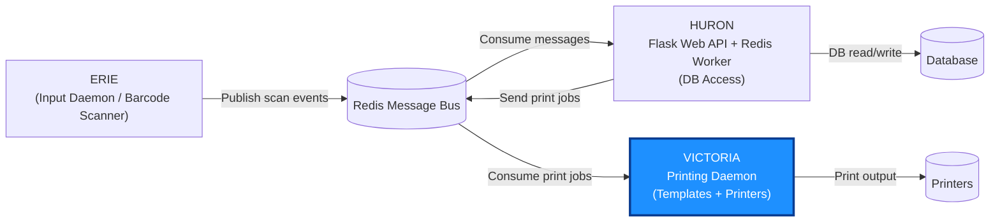

# Victoria

Victoria is a barcode printing daemon that receives print jobs over
_Redis_, renders them into printer-native formats (ZPL, JSON), and
dispatches the output to one or more network-connected printers.

It acts as an abstraction layer between upstream services and the
physical printers, handling label templating, dialect conversion, and
multi-printer routing.



## Quick Start

```bash
virtualenv venv && source venv/bin/activate
pip install -r requirements.txt && pip install -e .
python -m victoria --no-daemon --debug
```

## Configuration

Victoria is configured via a YAML (or JSON) file passed with the `-c` flag.

```bash
python -m victoria -c configs/config.yaml
```

### Config File Structure

The config file is wrapped under the `victoria` top-level key. Example:

```yaml
victoria:
    name: "victoria"       # Familiar name of the application.
    debug: false            # Enable debug logging level (default: warn).
    nodaemon: true          # Run in foreground instead of daemonizing.
    logfile: "/var/log/victoria.log"  # Log file path (default: stdout).
    pidfile: "/run/victoria.pid"      # PID file for daemon mode (default: none).
    publisher:              # Default publisher used when a printer doesn't define its own.
      type: "redis"         # Publisher backend: "redis" or "stdout".
      host: "localhost"     # Redis host address.
      port: 6379            # Redis port.
      channel: "victoria-out" # Redis channel name for outgoing messages.
      db: 0                 # Redis database number.
    printers:               # List of printer definitions.
      - name: "main"        # Unique name identifying this printer.
        reader:             # Input source for print jobs.
          type: "redis"     # Reader type: "redis", "stdin", or "evdev".
          channel: "victoria" # Redis channel this printer listens on.
          host: "localhost" # Redis host (for "redis" type).
          port: 6379        # Redis port (for "redis" type).
          db: 0             # Redis database number.
        template:           # Label template configuration.
          dialect: "zpl"    # Template dialect: "zpl" for Zebra printers or "json" for debugging.
          width: 100        # Label width in dots.
          height: 150       # Label height in dots.
        printer:            # Output destination for rendered labels.
          type: "static"    # Printer type: "static" (network) or "stdout" (console).
          address: "192.168.8.8" # Printer IP address (required for "static" type).
          port: 9100        # Printer port (required for "static" type).
        publisher:          # Per-printer publisher override (optional, uses default if omitted).
          type: "redis"
          channel: "victoria-out"
```

## Development

### Linting

```bash
ruff check .
```

### Testing

```bash
pytest test/ -v --timeout=5
```

CI runs on GitHub Actions with Python 3.12.

### Scripts

A set of utility scripts are available in the `/utils` directory.

| Script | Description |
|--------|-------------|
| `gen.py` | Generate a label template. Accepts `--title` for the label title and `--barcode` for the barcode data. |
| `print.py` | Send a print request through Redis to the running `victoria` daemon. |

## License

GPL-3.0, see [LICENSE](LICENSE) for details.

## Useful links

* [Zebra ZPL Manual](https://www.zebra.com/content/dam/zebra/manuals/printers/common/programming/zpl-zbi2-pm-en.pdf)
* [Label Viewer](http://labelary.com/viewer.html)
* [Z4M Printer Manual](https://www.servopack.de/support/zebra/Z4Mplus_Z6Mplus.pdf)
